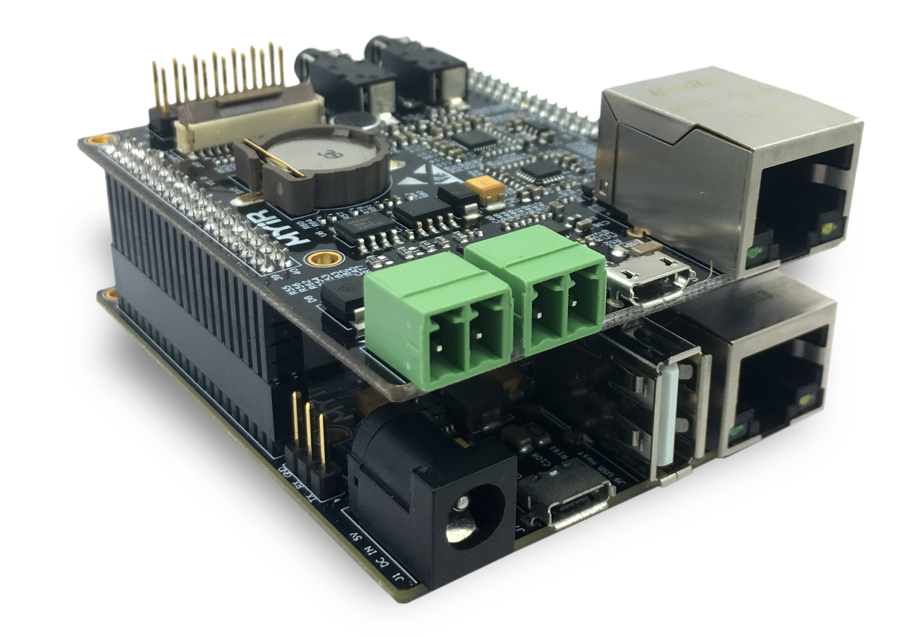

# 2 Deploy Development Environment

You need to install the Linux Operation System on your host PC.Recommend to use the Ubuntu 16.04 64bit distribution, and connect the network.Next steps we will install some packages from internet.

## Connect development board with PC

1. PC use USB to TLL cable with DEBUG port(JP1) on board.
2. Open serial program with exist serial device

PC serial port configure parameters:

* Baudrate: 115200
* Data bit: 8bit
* Parity: None
* Stop bit: 1bit
* Flow control: Disable


Figure2-1 MYS-6ULX-IND connection diagram


Figure2-2 MYS-6ULX-IoT connection diagram


Figure2-3 MYB-6ULX interface diagram



Figure2-4 MYS-6ULX install MYB-6ULX diagram

## Install Necessary Software Packages

```
sudo apt-get install build-essential git-core libncurses5-dev flex bison \
texinfo zip unzip zlib1g-dev gettext u-boot-tools g++ xz-utils mtd-utils \
gawk diffstat gcc-multilib
```

## Build work directory
Create a working directory to facilitate the creation of an unified environment variable path. Copy the product CD-ROM source code to the working directory, while setting the DEV_ROOT variable to enable the follow-up step path accessed.

```
mkdir -p ~/MYS6ULx-devel
export DEV_ROOT=~/MYS6ULx-devel
cp -r <DVDROM>/02-Images $DEV_ROOT
cp -r <DVDROM>/03-Tools $DEV_ROOT
cp -r <DVDROM>/04-Source $DEV_ROOT
```  

## Configure toolchain

- Linaro toolchain : gcc version 4.9.3 20141031 (prerelease) (Linaro GCC 2014.11)
- Yocto toolchain: gcc version 5.3.0 (GCC)

There are two cross compile toolchinas, one is support by Linaro.Another built by Yocto.Recommend you use Yocto version to build all source code.

### Linaro Toolchain

```
cd $DEV_ROOT/
tar -xvjf 03-Tools/Toolchain/gcc-linaro-4.9-2014.11-x86_64_arm-linux-gnueabihf.tar.xz
export PATH=$PATH:$DEV_ROOT/gcc-linaro-4.9-2014.11-x86_64_arm-linux-gnueabihf/bin
export CROSS_COMPILE=arm-linux-gnueabihf-
export ARCH=arm
```

Check the toolchain is correct using below command.You have setup correct environment on current SHELL when you get version infomation.If you want it always available, you need to modify your shell config file.

```
$ arm-linux-gnueabihf-gcc -v
Using built-in specs.
COLLECT_GCC=arm-linux-gnueabihf-gcc
COLLECT_LTO_WRAPPER=/home/kevinchen/SAMA5D4/gcc-linaro-4.9-2014.
11-x86_64_arm-linux-gnueabihf/bin/../libexec/gcc/arm-linux-gnuea
bihf/4.9.3/lto-wrapper
Target: arm-linux-gnueabihf
Configured with: /home/buildslave/workspace/BinaryRelease/label/
x86_64/target/arm-linux-gnueabihf/snapshots/gcc-linaro-4.9-2014.
11/configure SHELL=/bin/bash --with-bugurl=https://bugs.linaro.o
rg --with-mpc=/home/buildslave/workspace/BinaryRelease/label/x86
_64/target/arm-linux-gnueabihf/_build/builds/destdir/x86_64-unkn
own-linux-gnu --with-mpfr=/home/buildslave/workspace/BinaryRelea
se/label/x86_64/target/arm-linux-gnueabihf/_build/builds/destdir
/x86_64-unknown-linux-gnu
--with-gmp=/home/buildslave/workspace/BinaryRelease/label/x86_64
/target/arm-linux-gnueabihf/_build/builds/destdir/x86_64-unknown
-linux-gnu --with-gnu-as --with-gnu-ld --disable-libstdcxx-pch -
-disable-libmudflap --with-cloog=no --with-ppl=no --with-isl=no 
--disable-nls --enable-multiarch --disable-multilib --enable-c99
--with-tune=cortex-a9 --with-arch=armv7-a --with-fpu=vfpv3-d16 -
-with-float=hard --with-mode=thumb --disable-shared --enable-sta
tic
--with-build-sysroot=/home/buildslave/workspace/BinaryRelease/la
bel/x86_64/target/arm-linux-gnueabihf/_build/sysroots/arm-linux-
gnueabihf --enable-lto --enable-linker-build-id --enable-long-lo
ng --enable-shared --with-sysroot=/home/buildslave/workspace/Bin
aryRelease/label/x86_64/target/arm-linux-gnueabihf/_build/builds
/destdir/x86_64-unknown-linux-gnu/libc --enable-languages=c,c++,
fortran,lto -enable-fix-cortex-a53-835769 --enable-checking=rele
ase --with-bugurl=https://bugs.linaro.org
--with-pkgversion='Linaro GCC 2014.11' --build=x86_64-unknown-li
nux-gnu --host=x86_64-unknown-linux-gnu --target=arm-linux-gnuea
bihf --prefix=/home/buildslave/workspace/BinaryRelease/label/x86
_64/target/arm-linux-gnueabihf/_build/builds/destdir/x86_64-unkn
own-linux-gnu
Thread model: posix
gcc version 4.9.3 20141031 (prerelease) (Linaro GCC 2014.11)
```

### Yocto Toolchain

Yocto supports two kinds toolchain, one is low-level development toolchain meta-toolchain, another is application development toolchain.The low-level toolchain likes Linaro.The another used for application development, include more third libaries and header files.The MYS-6ULX also supports two kinds, those file name is "myir-imx-fb-glibc-x86_64-fsl-image-qt5-cortexa7hf-neon-toolchain-4.1.15-2.0.1.sh" and "myir-imx-fb-glibc-x86_64-meta-toolchain-cortexa7hf-neon-toolchain-4.1.15-2.0.1.sh".

Yocto toolchain distribute SDK package type. You need install the toolchain SDK package, then use it. Below is install method:

Run shell script as normal user.It will request you to input install path, default is under "/opt" directory.Then you will reuquest to set permission to directory. You can use "source" or "." to load toolchain environment to current shell when your installation finish.

Below example intall the toolchain into '/opt/myir-imx6ulx-fb/4.1.15-2.0.1' directory.

```
$ ./myir-imx-fb-glibc-x86_64-fsl-image-qt5-cortexa7hf-neon-\
toolchain-4.1.15-2.0.1.sh 
Freescale i.MX Release Distro SDK installer version 4.1.15-2.0.1
================================================================
Enter target directory for SDK (default: /opt/myir-imx-fb/4.1.15
-2.0.1): /opt/myir-imx6ulx-fb/4.1.15-2.0.1                                        
Do You are about to install the SDK to "/opt/myir-imx6ulx-fb/4.1
.15-2.0.1". Proceed[Y/n]? Y
[sudo] password for kevinchen: 
Extracting SDK..................................................
................................................................
...............done
Setting it up...done
SDK has been successfully set up and is ready to be used.
Each time you wish to use the SDK in a new shell session, you ne
ed to source the environment setup script e.g.
$ . /opt/myir-imx6ulx-fb/4.1.15-2.0.1/environment-setup-cortexa7
hf-neon-poky-linux-gnueabi

```

Check the toolchain SDK is correct after installation.Using the "source" command to load environment file to shell and check the compiler version.

```
source /opt/myir-imx6ulx-fb/4.1.15-2.0.1/environment-setup-corte
xa7hf-neon-poky-linux-gnueabi
arm-poky-linux-gnueabi-gcc -v
Using built-in specs.
COLLECT_GCC=arm-poky-linux-gnueabi-gcc
COLLECT_LTO_WRAPPER=/opt/myir-imx6ulx-fb/4.1.15-2.0.1/sysroots/
x86_64-pokysdk-linux/usr/libexec/arm-poky-linux-gnueabi/gcc/arm-
poky-linux-gnueabi/5.3.0/lto-wrapper
Target: arm-poky-linux-gnueabi
Configured with: ../../../../../../work-shared/gcc-5.3.0-r0/gcc-
5.3.0/configure --build=x86_64-linux --host=x86_64-pokysdk-linux
--target=arm-poky-linux-gnueabi --prefix=/opt/myir-imx6ulx-fb/4.
1.15-2.0.1/sysroots/x86_64-pokysdk-linux/usr --exec_prefix=/opt/
myir-imx6ulx-fb/4.1.15-2.0.1/sysroots/x86_64-pokysdk-linux/usr 
--bindir=/opt/myir-imx6ulx-fb/4.1.15-2.0.1/sysroots/x86_64-pokys
dk-linux/usr/bin/arm-poky-linux-gnueabi
--sbindir=/opt/myir-imx6ulx-fb/4.1.15-2.0.1/sysroots/x86_64-poky
sdk-linux/usr/bin/arm-poky-linux-gnueabi --libexecdir=/opt/myir-
imx6ulx-fb/4.1.15-2.0.1/sysroots/x86_64-pokysdk-linux/usr/libexe
c/arm-poky-linux-gnueabi --datadir=/opt/myir-imx6ulx-fb/4.1.15-2
.0.1/sysroots/x86_64-pokysdk-linux/usr/share --sysconfdir=/opt/m
yir-imx6ulx-fb/4.1.15-2.0.1/sysroots/x86_64-pokysdk-linux/etc --
sharedstatedir=/opt/myir-imx6ulx-fb/4.1.15-2.0.1/sysroots/x86_64
-pokysdk-linux/com
--localstatedir=/opt/myir-imx6ulx-fb/4.1.15-2.0.1/sysroots/x86_6
4-pokysdk-linux/var --libdir=/opt/myir-imx6ulx-fb/4.1.15-2.0.1/s
ysroots/x86_64-pokysdk-linux/usr/lib/arm-poky-linux-gnueabi --in
cludedir=/opt/myir-imx6ulx-fb/4.1.15-2.0.1/sysroots/x86_64-pokys
dk-linux/usr/include --oldincludedir=/opt/myir-imx6ulx-fb/4.1.15
-2.0.1/sysroots/x86_64-pokysdk-linux/usr/include --infodir=/opt/
myir-imx6ulx-fb/4.1.15-2.0.1/sysroots/x86_64-pokysdk-linux/usr/s
hare/info
--mandir=/opt/myir-imx6ulx-fb/4.1.15-2.0.1/sysroots/x86_64-pokys
dk-linux/usr/share/man --disable-silent-rules --disable-dependen
cy-tracking --with-libtool-sysroot=/home/blackrose/mys-imx6ul/fs
l-release-yocto/build/tmp/sysroots/x86_64-nativesdk-pokysdk-linu
x --with-gnu-ld --enable-shared --enable-languages=c,c++ --enabl
e-threads=posix --enable-multilib --enable-c99 --enable-long-lon
g --enable-symvers=gnu --enable-libstdcxx-pch --program-prefix=a
rm-poky-linux-gnueabi- --without-local-prefix --enable-lto --ena
ble-libssp --enable-libitm --disable-bootstrap --disable-libmudf
lap --with-system-zlib --with-linker-hash-style=gnu --enable-lin
ker-build-id --with-ppl=no --with-cloog=no --enable-checking=rel
ease --enable-cheaders=c_global --without-isl --with-gxx-include
-dir=/not/exist/usr/include/c++/5.3.0 --with-build-time-tools=/h
ome/blackrose/mys-imx6ul/fsl-release-yocto/build/tmp/sysroots/x8
6_64-linux/usr/arm-poky-linux-gnueabi/bin --with-sysroot=/not/ex
ist --with-build-sysroot=/home/blackrose/mys-imx6ul/fsl-release-
yocto/build/tmp/sysroots/mys6ul14x14 --enable-poison-system-dire
ctories --with-mpfr=/home/blackrose/mys-imx6ul/fsl-release-yocto
/build/tmp/sysroots/x86_64-nativesdk-pokysdk-linux --with-mpc=/h
ome/blackrose/mys-imx6ul/fsl-release-yocto/build/tmp/sysroots/x8
6_64-nativesdk-pokysdk-linux --enable-nls --with-arch=armv7-a
Thread model: posix
gcc version 5.3.0 (GCC) 
```

According the steps, you can install the low-level toolchain meta-toolcahin.Please input differenct directory to store the toolchian, otherwize it will cover exist files in same directory.
