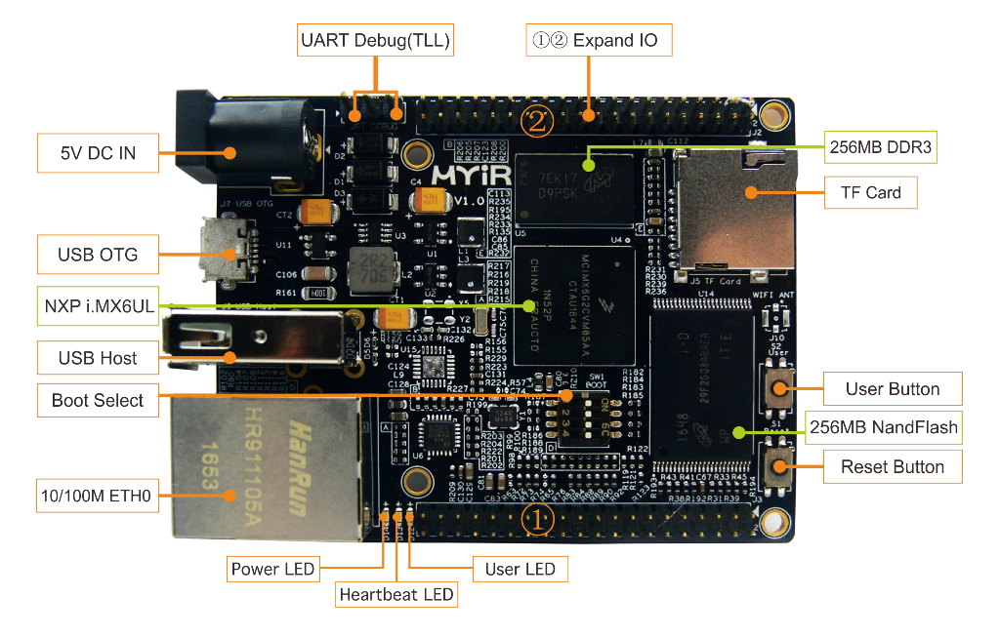

# 2 Deploy Development Environment

You need to install the Linux Operation System on your host PC.Recommend to use the Ubuntu 16.04 64bit distribution, and connect the network.Next steps we will install some packages from internet.

## Connect development board with PC

1. PC use USB to TLL cable with DEBUG port(JP1) on board.
2. Open serial program with exist serial device

PC serial port configure parameters:

* Baudrate: 115200
* Data bit: 8bit
* Parity: None
* Stop bit: 1bit
* Flow control: Disable



Figure2-1 MYC-Y6ULX top view


Figure2-2 MYD-Y6ULX top view

## Install necessary software packages

```
sudo apt-get install build-essential git-core libncurses5-dev flex bison \
texinfo zip unzip zlib1g-dev gettext u-boot-tools g++ xz-utils mtd-utils \
gawk diffstat gcc-multilib
```

## Build work directory
Create a working directory to facilitate the creation of an unified environment variable path. Copy the product CD-ROM source code to the working directory, while setting the DEV_ROOT variable to enable the follow-up step path accessed.

```
mkdir -p ~/MYD-Y6ULX-devel
export DEV_ROOT=~/MYD-Y6ULX-devel
cp -r <DVDROM>/02-Images $DEV_ROOT
cp -r <DVDROM>/03-Tools $DEV_ROOT
cp -r <DVDROM>/04-Source $DEV_ROOT
```  

## Configure toolchain

- Linaro toolchain : gcc version 4.9.3 20141031 (prerelease) (Linaro GCC 2014.11)
- Yocto toolchain: gcc version 5.3.0 (GCC)

There are two cross compile toolchains, one is support by Linaro.Another built by Yocto.Recommend you use Yocto toolchain to build all source code.

### Linaro Toolchain

```
cd $DEV_ROOT/
tar -xvjf 03-Tools/Toolchain/gcc-linaro-4.9-2014.11-x86_64_arm-linux-gnueabihf.tar.xz
export PATH=$PATH:$DEV_ROOT/gcc-linaro-4.9-2014.11-x86_64_arm-linux-gnueabihf/bin
export CROSS_COMPILE=arm-linux-gnueabihf-
export ARCH=arm
```

Check if the toolchain is correct using below command.You have setup correct environment on current SHELL when you get version infomation.If you want it always available, you need to modify your shell config file.

```
$ arm-linux-gnueabihf-gcc --version

arm-linux-gnueabihf-gcc (Linaro GCC 2014.11) 4.9.3 20141031 (prerelease)
Copyright (C) 2014 Free Software Foundation, Inc.
This is free software; see the source for copying conditions.  There is NO
warranty; not even for MERCHANTABILITY or FITNESS FOR A PARTICULAR PURPOSE.
```

### Yocto Toolchain

Yocto provide two kinds toolchain, one is low-level development toolchain meta-toolchain, another is application development toolchain.The low-level toolchain likes Linaro.The another used for application development, include more third libaries and header files.The MYD-Y6ULX also supports two kinds, those files are list below.

Toolchain file name | Description
------------ | -----
myir-imx-fb-glibc-x86_64-fsl-image-qt5-cortexa7hf-neon-toolchain-4.1.15-2.0.1.sh | toolchain for fsl-image-qt5 system image, icludes Qt5 libraries
myir-imx-fb-glibc-x86_64-core-image-base-cortexa7hf-neon-toolchain-4.1.15-2.0.1.sh | toolchain for core-image-base system image, without any graphics libraries
myir-imx-fb-glibc-x86_64-meta-toolchain-cortexa7hf-neon-toolchain-4.1.15-2.0.1.sh | meta-toolchain


Yocto toolchain distribute SDK package type. You need install the toolchain SDK package, then use it. Below is install method:

Run shell script as normal user.It will request you to input install path, default is under "/opt" directory.Then you will reuquest to set permission to directory. You can use "source" or "." to load toolchain environment to current shell when your installation finish.

Below example intall the toolchain into '/opt/myir-imx6ulx-fb/4.1.15-2.0.1' directory.

```
$ ./myir-imx-fb-glibc-x86_64-fsl-image-qt5-cortexa7hf-neon-toolchain-4.1.15-2.0.1.sh 
Freescale i.MX Release Distro SDK installer version 4.1.15-2.0.1
================================================================
Enter target directory for SDK (default: /opt/myir-imx-fb/4.1.15-2.0.1): /opt/myir-imx6ulx-fb/4.1.15-2.0.1
Do You are about to install the SDK to "/opt/myir-imx6ulx-fb/4.1.15-2.0.1". Proceed[Y/n]? Y
[sudo] password for kevinchen: 
Extracting SDK..................................................
................................................................
...............done
Setting it up...done
SDK has been successfully set up and is ready to be used.
Each time you wish to use the SDK in a new shell session, you ne
ed to source the environment setup script e.g.
$ . /opt/myir-imx6ulx-fb/4.1.15-2.0.1/environment-setup-cortexa7hf-neon-poky-linux-gnueabi

```

Check the toolchain SDK is correct after installation.Using the "source" command to load environment file to shell and check the compiler version.

```
source /opt/myir-imx6ulx-fb/4.1.15-2.0.1/environment-setup-cortexa7hf-neon-poky-linux-gnueabi
arm-poky-linux-gnueabi-gcc --version

arm-poky-linux-gnueabi-gcc (GCC) 5.3.0
Copyright (C) 2015 Free Software Foundation, Inc.
This is free software; see the source for copying conditions.  There is NO
warranty; not even for MERCHANTABILITY or FITNESS FOR A PARTICULAR PURPOSE.
```

According the steps, you can install the low-level toolchain meta-toolcahin.Please input different directory to store the toolchian, otherwize it will cover existing files in same directory.
