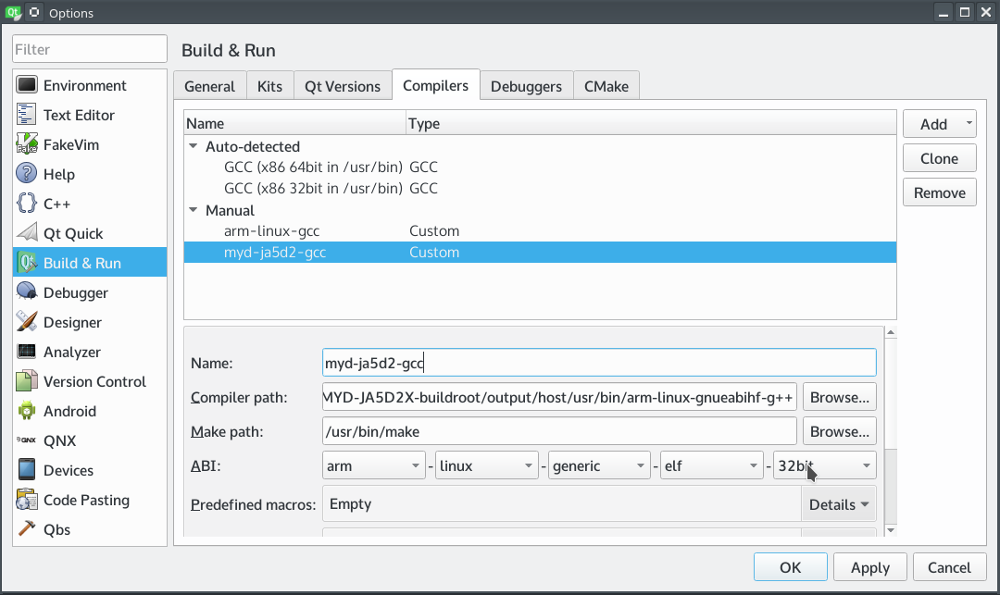
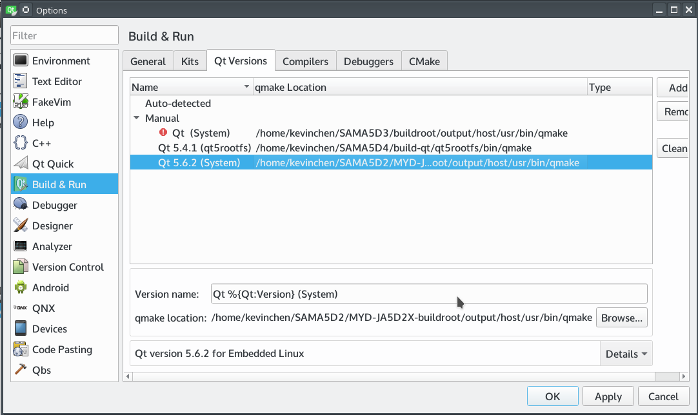
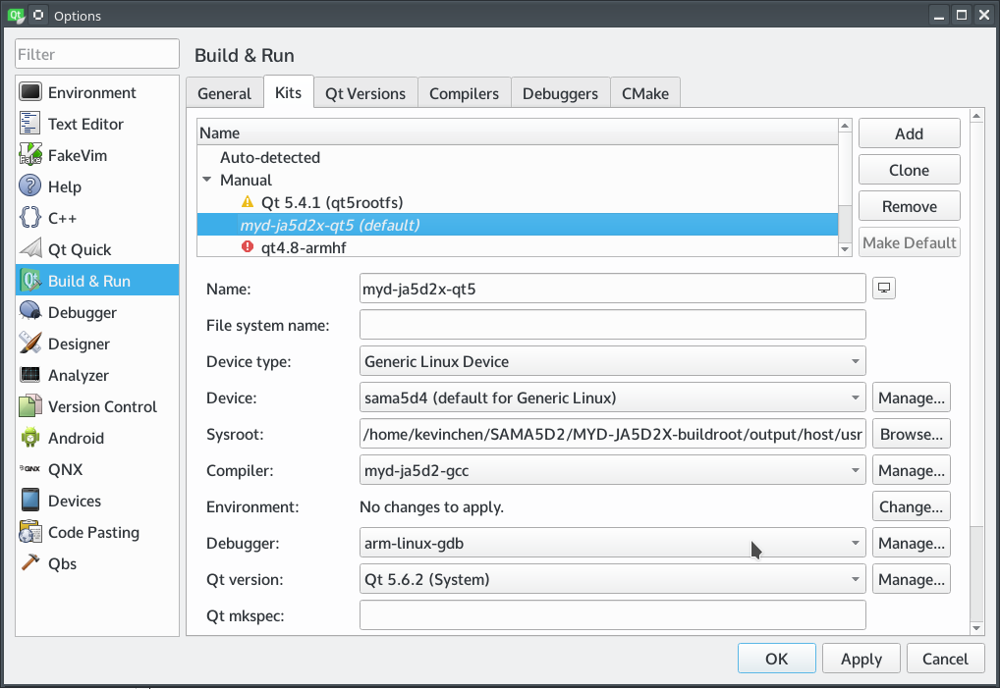

# 5.2 Configure QtCreator

The first step. Run QtCreator, followed by "Tool" -> "Options", the Options dialog box appears, click "Build & Run" on the left, right select "Compilers" label.
Click on the right "Add" button, pop-up drop-down list, select "custom", fill the following input boxes, Name, Compiler path, Make path and ABI. When you are done, click "Apply".

Figure5-1 Configure Compiler

The second step. and then select the "Qt Version" tab, click the right side of the "Add ...", will pop up qmake path selection dialog box, switch the directory to the previous buildroot compiled directory "output / host / usr / bin" directory , Select "qmake" file, click the "Open" button and then click "Apply" button.

Figure5-2 Configure Qt version

The third step. select the top of the "Kits" label, click the "Add" button, fill in the corresponding content. The "Sysroot" input box selects the directory of the compilation tool chain, and the "compiler" selects the name that was previously filled in. The "debugger" selects "None", "Qt version", and the name "CMake Tool" is selected by default.

Figure5-3 Configure Qt version
