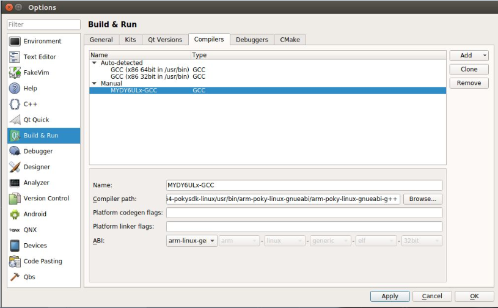

# 5.2 Configure QtCreator

The first step, run QtCreator, followed by "Tool" -> "Options", the Options dialog box appears, click "Build & Run" on the left, right select "Compilers" label.
Click on the right "Add" button, pop-up drop-down list, select "GCC", fill the following input boxes, "Name" is "MYDY6ULx-GCC", click "Compiler path" beside "Browse.." button to choose "arm-poky-linux-gnueabi-g++" file path. In this case, the path is "/opt/myir-imx6ulx-fb/4.1.15-2.0.1/sysroots/x86_64-pokysdk-linux/usr/bin/arm-poky-linux-gnueabi/arm-poky-linux-gnueabi-g++".When fill are complete, click "Apply".

Figure5-1 Config Compiler

The second step, and then select the "Qt Version" tab, click the right side of the "Add ...", will pop up qmake path selection dialog box.In this case, qmake file path is "/opt/myir-imx6ulx-fb/4.1.15-2.0.1/sysroots/x86_64-pokysdk-linux/usr/bin/qt5", and choose "qmake" file. click the "Open" button then change "Version name" is "Qt %{Qt:Version} (MYDY6ulx-qt5)".After that click "Apply" button.

Figure5-2 Configure Qt version

The third step, click the "Device" menu on left panel, and click "Add..." button on right panel.Fill those input box, "Name" is "MYDY6ULx Board", "Host name" is IP address of target board(alsa fill any one), "Username" is "root".Then clock "Apply" button.

Figure5-3 Configure Qt version

The fourth step, click "Build & Run" menu on left panel will back to "Kit" tab in right panel.The content fill with "Name" is "MYDY6ULx-dev-kit", "Device" choose "MYDY6ULx Board" option."Sysroot" choose the sysroot of target board.In this case , use "/opt/myir-imx6ulx-fb/4.1.15-2.0.1/sysroots/cortexa7hf-neon-poky-linux-gnueabi"."Compiler" choose "MYDY6ULx-GCC" before we configured."Qt version" choose "Qt 5.6.2 (MYDY6ulx-qt5)" before configured, "Qt mkspec" is "linux-oe-g++".Other use default option, then click"Apply" and "OK" button.

Figure5-4 Configure Kit
