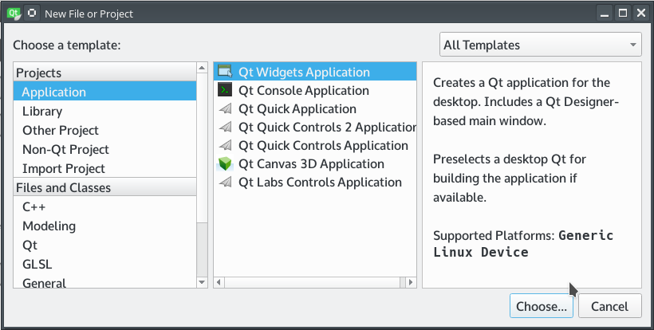
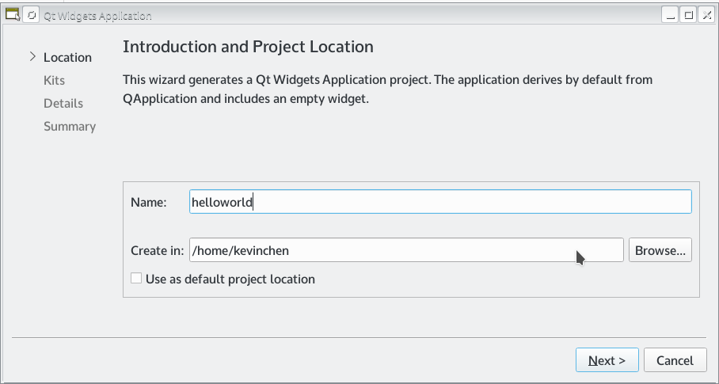
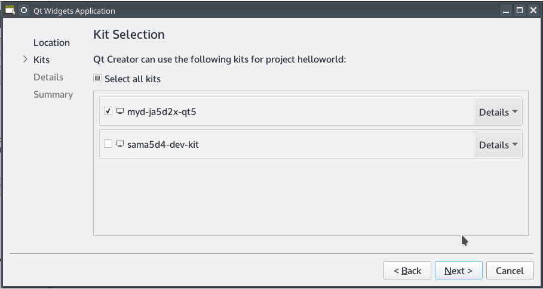
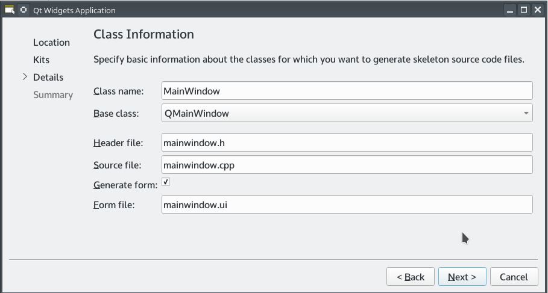
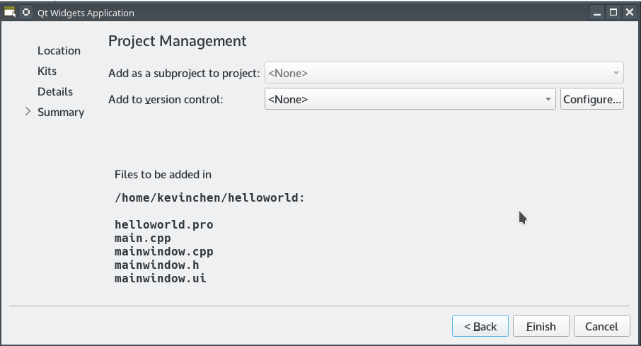
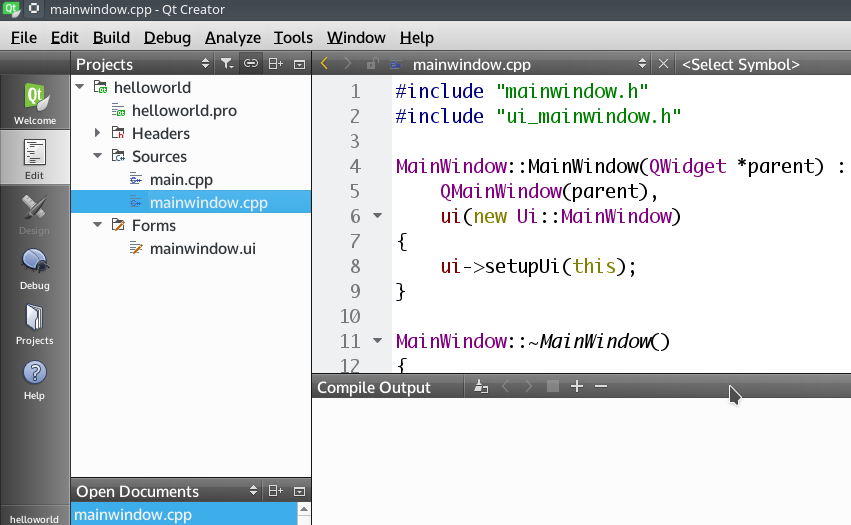
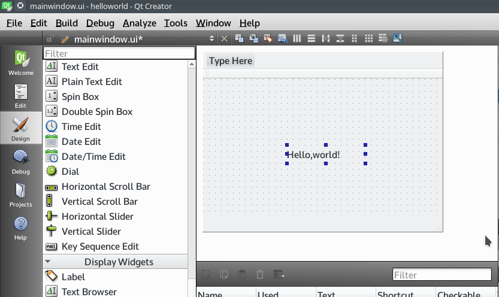
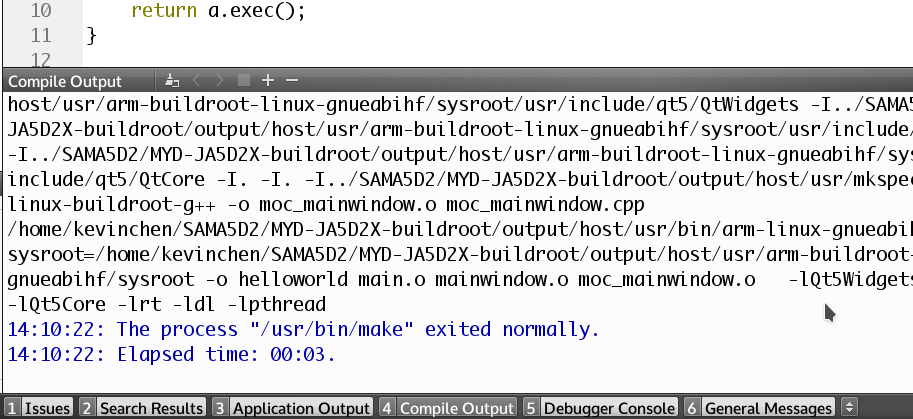
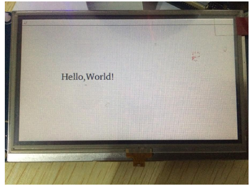

# 5.3 Test Qt application

Create a Helloworld project in QtCreator and run it on the development board after compilation.

The first step, in the menu bar, select "File" -> "New File or Project", in the open dialog box, select "Application" -> "Qt Widgets Application", click "Choose ...".


Figure5-4 New Project Wizard1

The second step, in the pop-up "Qt Widgets Application" dialog box, the name field fill "helloworld", "Create in" for the storage path, the default can, and then click "Next".


Figure5-5 New Project Wizard2

The third step, select the name of the compiler before adding a good, click "Next".


Figure5-6 New Project Wizard3

The fourth step, here choose hellowrold application base class, the default QMainWindow can, click "Next".


Figure5-7 New Project Wizard3

Step 5, fill out the above information, click "Finish", QtCreator help us create a new project.


Figure5-8 New Project Wizard4

The following is a screenshot of the created helloworld project, the left is the project directory structure, the right is the code editing area.


Figure5-9 New Project Wizard5

Step 6, double-click the left side of the "Forms" in the "mainwindow.ui" file, open the "Design" view.
From the left "Display Widgets" section, drag "Label" to the middle of the Widget area. Double click, modify the content to "Hello, world!".


Figure5-10 Design View

Step 7, click the menu bar "Build" -> "Build Project hellowrld" button, you can complete the project compilation, while the next side will compile the process output.


Figure5-11 Compling output

QtCreator build helloworld project, compiled binary files stored in the "~ / build-helloworld-myd_ja5d2x_qt5-Debug /" directory, you can use the file command to see whether is the compiler for the ARM architecture.

```
$ file helloworld
helloworld: ELF 32-bit LSB executable, ARM, EABI5 version 1 (SYSV),
dynamically linked (uses shared libs), for GNU/Linux 2.6.31,
BuildID[sha1]=dd0132f1a260f8439ad21fff7e5c4ada574cd58a, not
stripped
```

Copy the helloworld file to board and run it.

```
# ./helloworld
```
The LCD shows Qt windows of "Hello,World!" string。


Figure5-12 Run example program
