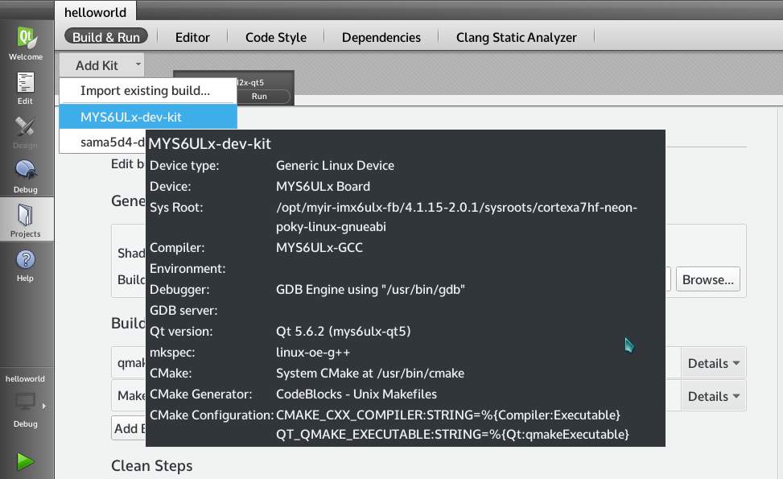
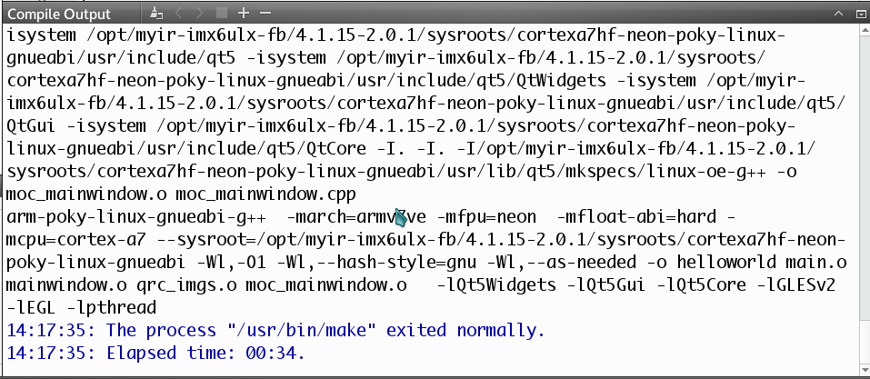

# 5.3 Test Qt application

Inorder to test last steps configure is correct, we support a Qt example.You just open, config and compile it.

The first step, in the menu bar, select "File" -> "Open File or Project", in the open dialog box, browse and select "hellowrold" example project, choose "helloworld.pro" file,  click "Open" button.

The scond step, choose "Projects" icon in left panel.The right panel will switch to "Build & Run" tab of "helloworld" project, click "Add kit" pop-down list, and choose "MYS6ULx-dev-kit" option.Then the "helloworld" project will use "MYS6ULx-dev-kit" option to build it. 


图5-3-1 config build option

Step 3, click the menu bar "Build" -> "Build Project hellowrld" button, you can complete the project compilation, while the next side will compile the process output.


Figure5-3-2 Compling output

QtCreator build helloworld project, compiled binary files stored in the "~/build-helloworld-MYS6ULx_dev_kit-Debug/" directory, you can use the file command to see whether is the compiler for the ARM architecture.

```
file ~/build-helloworld-MYS6ULx_dev_kit-Debug/helloworld
/home/kevinchen/build-helloworld-MYS6ULx_dev_kit-Debug/helloworld: ELF 32-bit LSB executable, ARM, EABI5 version 1 (GNU/Linux), dynamically linked, interpreter /lib/ld-linux-armhf.so.3, for GNU/Linux 2.6.32, BuildID[sha1]=9c5f22deb1d8272c2a81528c171d215896112784, not stripped
```

Copy the helloworld file to board and run it.

```
# ./helloworld -platform linuxfb
```
The LCD shows Qt windows of "Hello,World!" string。


Figure5-3-3 Run example program
