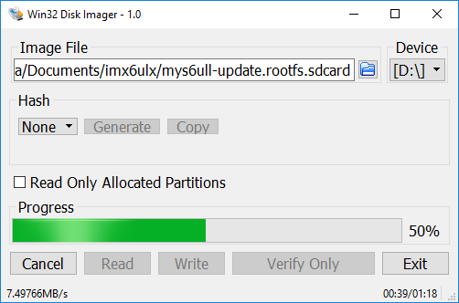

# 6.2 SD Card Update

The sdcard image file needs special tool to write Micro SD storage card.The linux user can directly use dd command.The windows user need "Win32ImageWriter" tool.

MYD-Y6ULX series boards provide two sdcard file.It's path in directory 02-Images.

Fiile Name | Description
------ | -----
myd-y6ull-update-nand-base-20171026011019.rootfs.sdcard.gz | Used update core-image-base for MYD-Y6ULL
myd-y6ull-update-nand-qt5-20171026011028.rootfs.sdcard.gz | Used update fsl-image-qt5 for MYD-Y6ULL
myd-y6ul-update-nand-base-20171026011019.rootfs.sdcard.gz| Used update core-image-base for MYD-Y6UL

Attention: The date string tag is generated by the tool on file name *.rootfs.sdcard.Please be based on actual.

## Build updatable SD Card system image

If you modify the Linux kernel, U-Boot or Yocto, then you need a tool for update those files into the board.
The MYD-Y6ULX board support a tool MYD-Y6ULX-mkupdate-sdcard that builds updatable SD Card image.It locates in '04-Tools/ManufactoryTool' directory.

The build-sdcard.sh script used to generate a system image that contains update system and update target files.
The firmware directory used for the system of the update.Generally, you do not modify it otherwise your NAND flash or other BSP code changed.

The "mfgimages-*" directory store need update files.Those name of files are defined in 'Manifest' file, please follow below rules:

```
ubootfile="u-boot.imx"
kernelfile="zImage"
dtbfile="myd-y6ull-14x14-gpmi-weim.dtb"
rootfsfile="core-image-base.rootfs.tar.xz"
```
The 'envfile' variable only used for eMMC flash type.
The update program will read the Manifest file and load those files be written into flash.

```
sudo ./build-sdcard.sh -p myd-y6ull -n -d mfgimages-myd-y6ull-ddr256m-nand256m
```
The tool support four arguments.
'-p' stands for a platform, the value is 'myd-y6ull'.
'-n' stands for the storage device of NAND flash.
'-e' stands for the storage  device of eMMC flash.
'-d' stands for target files directory.

Attention: the '-n' and '-e' do not both exist in the argument.

After builds complete, a sdcard.gz suffix file in current directory, 'myd-y6ull-update-nand-20170825150819.rootfs.sdcard.gz'.

## Making updatable Micro SD

Insert Micro SD card to Card Reader, and plug into PC USB port.MYD-Y6ULX resource package support some prebuilt sdcard.gz files.You can use the tool to write it into your SD card.Those files locate in 02-Images direcory of resource package.

Attention: The date tag of file name is always changed, please follow the actual in 02-Images directory.

* Linux system

Generally, linux use "sd[x][n]" format to naming a storage device.The x means which storage device, represent use a ~ z character.The n means partition that storage device, use digit start from 1. You can use "dmesg | tail" command to view device name when you plugin Card Reader.In this case, we use "/dev/sdb" as example.

Attention: the "/dev/sdb" do not append any digit

Write sdcard file into USB storage:
```
sudo dd if=myd-y6ull-update-nand-20190919090957.sdcard of=/dev/sdb conv=fsync
```

Write sdcard.gz file into USB storage:
```
gzip -dc myd-y6ull-update-nand-20190919090957.sdcard.gz | sudo dd of=/dev/sdb conv=fsync
```

The write speed is relative with USB host version and Micro SD card write speed. We recommend use higher speed class Micro SD storage card.

* Windows system

The Windows user can use Win32DiskImager tool to write sdcard image file to Micro SD storage card.The tool is located in "03-Tools" directory.Extract it and double click "Win32DiskImager.exe" program.After Win32DiskImager window shows up, the right "Device" list is to choose which device needs to operation.The left "Image File" input box is to show which file needs to be operation through the folder icon to browse and choose file.(Attention: the file choose dialog default use "*.img" to filter
files, you need change it to "*.*" type)

You need confirm the device and file before write operation.The wrong device will damage your system partition or other storage device.

In this case, "D:" is the Card Reader device.

Attention: You need extract the sdcard.gz file when you use Win32DiskImage write into USB storage.The USB Image Tool support the sdcard.gz file.



You can plug out Card Reader after progress bard finish.

Take the Micro SD card insert into card slot(J5) on MYD-Y6ULX series boards.Then change boot switch as SDCARD type: 

Boot bit | Status
--- | ----
Bit1 | ON
Bit2 | OFF
Bit3 | ON
Bit4 | OFF

Use USB to TTL cable connect to Debug port(JP1), configure your serial terminal software.Use USB Micro B cable as power plug into USB OTG port(J7) on board(or use DC adapter plug into J1 interface).You can view update progress in serial terminal software.

Also, you can view the LED(D12) to get the current update state.In updating is flashing.The update success is light on, the update fail is light off.

## MYD-Y6ULX NAND flash
You need power down and change the boot switch(SW1) to NAND boot type when you follow each way from two ways.

Boot bit | Status
--- | ----
Bit1 | OFF
Bit2 | ON
Bit3 | ON
Bit4 | OFF

Reconnect the power adapter, the board will boot into linux from NAND flash。

## MYD-Y6ULX eMMC flash
You need power down and change the boot switch(SW1) to eMMC boot type when you follow each way from two ways.

Boot bit | Status
--- | ----
Bit1 | OFF
Bit2 | OFF
Bit3 | ON
Bit4 | OFF

Reconnect the power adapter, the board will boot into linux from eMMC flash。
