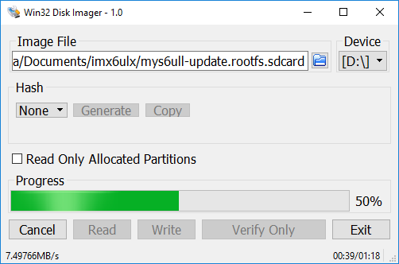

# 6 System update

MYS-6ULX series board use two methods to update system to NAND flash on board, MfgTool and SD card.

## MfgTool update method

### Install tool

The NXP supports a manufacture tool called MfgTool, we use MfgTool 2.7.0 version.The MfgTool suppors Windows and Linux system.It is located in directory "03-Tools/ManufactoryTool" of resource package.You can copy and extract it to your work directory.

### Update steps(follow the sequence):

Attention: Please do not both plugin DV 5V(J1) and micro usb(J7) at the same time

* Change third bit as ON, four bit as OFF on toggle switch(SW1).
* Use USB cable(Type-A to Micro-B) connect to micro usb port(J7) with PC USB port.
* Double click file "mfgtool2-yocto-mx6ul-evk-nand.vbs" under MfgTool directory, then the MfgTool will show the HID device on reconigz.
* Click the "Start" button on MfgTool GUI, it will auto download system image to storage of board.

The progress bar will show as green when update finish. While it will show as red if failed.In this case you can view "MfgTool.log" file to get more information.Another way is use USB to TTL cable connect to Debug port(JP1), you can view the serial port output to analysis failed reason after update again.

### Update files on MfgTool

MfgTool update files has two directories, firmware and files.The files directory store files for burn into flash of MYS-6ULX board. It's locate in "MYS-6ULX-mfgtools/Profiles/Linux/OS Firmware/files/".
The firmware directory store files for burn system.It's locate in "MYS-6ULX-mfgtools/Profiles/Linux/OS Firmware/firmware/".You need to update those files when you change flash size or partition offset.

list of files directory:

FileName | Description
---- | -----
imx6ull-rootfs_nogpu.tar.bz2 | MYS-6ULX-IND file system
imx6ul-rootfs_nogpu.tar.bz2 | MYS-6ULX-IoT file system
u-boot-imx6ul14x14evk_emmc.imx | support eMMC of uboot for MYS-6ULX-IND
u-boot-imx6ul14x14evk_nand.imx | support NAND of uboot for MYS-6ULX-IND
u-boot-imx6ull14x14evk_emmc.imx | support eMMC of uboot for MYS-6ULX-IoT
u-boot-imx6ull14x14evk_nand.imx | support NAND of uboot for MYS-6ULX-IoT
zImage | Linux kernel image for MYS-6ULX-IND and MYS-6ULX-IoT
zImage-imx6ul-14x14-evk-emmc.dtb | support eMMC of DeviceTree file for MYS-6ULX-IND
zImage-imx6ul-14x14-evk-gpmi-weim.dtb | support NAND of DeviceTree file for MYS-6ULX-IND
zImage-imx6ull-14x14-evk-emmc.dtb | support eMMC of DeviceTree file for MYS-6ULX-IoT
zImage-imx6ull-14x14-evk-gpmi-weim.dtb | support NAND of DeviceTree file for MYS-6ULX-IoT

## Micro SD card update method

Because i.MX6ULL/i.MX6UL chip need kobs-ng to add some header data to bootloader, so it needs read or write under system.
In this case, we support two suffix as sdcard image files, correspond to each board.Theee sdcard image file contains partition table info and data.It has two partitions, one is format as FAT and contain minimal system bootloader,kernel and be programming files.Another partition is a minimal file system, includes programming tool and update script.

The sdcard image file needs special tool to write Micro SD storage card.The linux user can directly use dd command.The windows user need "Win32ImageWriter" tool.

### Build updatable SD Card system image

If you modify the Linux kernel, U-Boot or Yocto, then you need a tool for update those files into the board.
The MYS-6ULX board support a tool MYS-6ULX-mkupdate-sdcard that builds updatable SD Card image.It locates in '04-Tools/ManufactoryTool' directory.

```
sudo ./build-sdcard.sh -p mys6ull -n -d mfgimages-mys-imx6ul-ddr256m-nand256m
```
The tool support four arguments.
'-p' stands for a platform, only two option 'mys6ull' and 'mys6ul'.
'-n' stands for the storage device of NAND flash.
'-e' stands for the storage  device of eMMC flash.
'-d' stands for target files directory.

Attention: the '-n' and '-e' do not both exist in the argument.

After builds complete, a sdcard suffix file in current directory, 'mys6ull-update-nand-20170825150819.rootfs.sdcard'.

### Build updatable Micro SD

Recommend insert Micro SD card to Card Reader, and plug into PC USB port.

* Linux system

Generally, linux use "sd[x][n]" format to naming a storage device.The x means which storage device, represent use a ~ z character.The n means partition that storage device, use digit start from 1. You can use "dmesg | tail" command to view device name when you plugin Card Reader.In this case, we use "/dev/sdb" as example.

Attention: the "/dev/sdb" do not append any digit

```
sudo dd if=mys6ull-update.sdcard of=/dev/sdb conv=fsync
```

The write speed is relative with USB host version and Micro SD card write speed. We recommend use higher speed class Micro SD storage card.

* Windows system

The Windows user can use Win32DiskImager tool to write sdcard image file to Micro SD storage card.The tool is located in "03-Tools" directory.Extract it and double click "Win32DiskImager.exe" program.After Win32DiskImager window shows up, the right "Device" list is to choose which device needs to operation.The left "Image File" input box is to show which file needs to be operation through the folder icon to browse and choose file.(Attention: the file choose dialog default use "*.img" to filter
files, you need change it to "*.*" type)

You need confirm the device and file before write operation.The wrong device will damage your system partition or other storage device.

In this case, "D:" is the Card Reader device.



You can plug out Card Reader after progress bard finish.

Take the Micro SD card insert into card slot(J5) on MYS-6ULX series boards.Then change boot toggle switch as SDCARD type: 

Boot bit | Status
--- | ----
Bit1 | OFF
Bit2 | ON
Bit3 | OFF
Bit4 | ON

Use USB to TTL cable connect to Debug port(JP1), configure your serial terminal software.Use USB Micro B cable as power plug into USB OTG port(J7) on board(or use DC adapter plug into J1 interface).You can view update progress in serial terminal software.

Also, you can through LED(D12) to view the current update status, the updating is flash, the update success is light on, the update fail is light off.

## Boot from NAND

You need power down and change the toggle switch(SW1) to NAND boot type when you follow each way from two ways.

Boot bit | Status
--- | ----
Bit1 | ON
Bit2 | OFF
Bit3 | OFF
Bit4 | ON

Reconnect the power adapter, the board will boot into linux on NAND flash。
