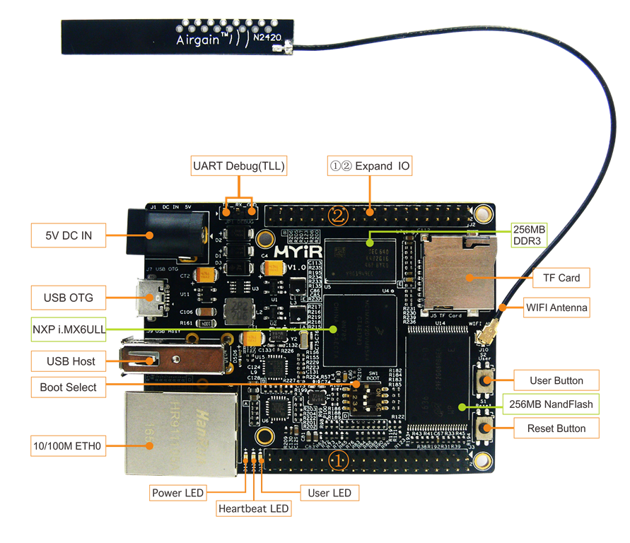

# 2 部署开发环境

开发前需要安装好Linux操作系统，推荐使用Ubuntu 16.04 64bit发行版，连接网线并配置好网络，后续操作需要连接互联网安装或下载相关软件包。

## 开发板与计算机连接

1. 计算机使用USB转TTL串口转接线与开发板的DEBUG串口(JP1)连接
2. 将电源适配器接入电源座(J1)

计算机端的串口配置参数如下：

* 波特率：115200
* 数据位: 8bit
* 校验方式：None
* 停止位：1bit
* 流控：Disable


图2-1 MYS-6UL-IND接口定义

图2-2 MYS-6ULL-IoT接口定义

## 安装必备软件包

```
sudo apt-get install build-essential git-core libncurses5-dev flex bison \
texinfo zip unzip zlib1g-dev gettext u-boot-tools g++ xz-utils mtd-utils \
gawk diffstat gcc-multilib
```

## 建立工作目录

建立工作目录，方便设置统一的环境变量路径。拷贝产品光盘中的源码到工作目录下，同时设置DEV_ROOT变量，方便后续步骤的路径访问。

```
mkdir -p ~/MYS6ULx-devel
export DEV_ROOT=~/MYS6ULx-devel
cp -r <DVDROM>/04-Source/* $DEV_ROOT
```  

## 配置编译工具

- Linaro交叉编译器: gcc version 4.9.3 20141031 (prerelease) (Linaro GCC 2014.11)
- Yocto交叉编译器: gcc version 5.3.0 (GCC)

这里有两个编译器，一个是Linaro提供，另一个是由Yocto构建的，建议使用Yocto提供的，以便和文件系统统一。

### Linaro编译器

```
cd $DEV_ROOT/Toolchain
tar -xvjf gcc-linaro-4.9-2014.11-x86_64_arm-linux-gnueabihf.tar.xz
export PATH=$PATH:$DEV_ROOT/Toolchain/gcc-linaro-4.9-2014.11-x86_64_arm-linux-gnueabihf/bin
export CROSS_COMPILE=arm-linux-gnueabihf-
export ARCH=arm
```
执行完上述命令后输入"arm-linux-gnueabihf -v"，若有输出版本信息，说明设置成功，以上设置只对当前终端有效。如需永久修改，请修改用户配置文件。

```
$ arm-linux-gnueabihf-gcc -v
Using built-in specs.
COLLECT_GCC=arm-linux-gnueabihf-gcc
COLLECT_LTO_WRAPPER=/home/kevinchen/MYS6ULx/gcc-linaro-4.9-2014.11-x86_64_arm-linux-gnueabihf/bin/../libexec/gcc/arm-linux-gnueabihf/4.9.3/lto-wrapper
Target: arm-linux-gnueabihf
Configured with: /home/buildslave/workspace/BinaryRelease/label/x86_64/target/arm-linux-gnueabihf/snapshots/gcc-linaro-4.9-2014.11/configure SHELL=/bin/bash --with-bugurl=https://bugs.linaro.org --with-mpc=/home/buildslave/workspace/BinaryRelease/label/x86_64/target/arm-linux-gnueabihf/_build/builds/destdir/x86_64-unknown-linux-gnu --with-mpfr=/home/buildslave/workspace/BinaryRelease/label/x86_64/target/arm-linux-gnueabihf/_build/builds/destdir/x86_64-unknown-linux-gnu
--with-gmp=/home/buildslave/workspace/BinaryRelease/label/x86_64/target/arm-linux-gnueabihf/_build/builds/destdir/x86_64-unknown-linux-gnu --with-gnu-as --with-gnu-ld --disable-libstdcxx-pch --disable-libmudflap --with-cloog=no --with-ppl=no --with-isl=no --disable-nls --enable-multiarch --disable-multilib --enable-c99 --with-tune=cortex-a9 --with-arch=armv7-a --with-fpu=vfpv3-d16 --with-float=hard --with-mode=thumb --disable-shared --enable-static
--with-build-sysroot=/home/buildslave/workspace/BinaryRelease/label/x86_64/target/arm-linux-gnueabihf/_build/sysroots/arm-linux-gnueabihf --enable-lto --enable-linker-build-id --enable-long-long --enable-shared --with-sysroot=/home/buildslave/workspace/BinaryRelease/label/x86_64/target/arm-linux-gnueabihf/_build/builds/destdir/x86_64-unknown-linux-gnu/libc --enable-languages=c,c++,fortran,lto -enable-fix-cortex-a53-835769 --enable-checking=release --with-bugurl=https://bugs.linaro.org
--with-pkgversion='Linaro GCC 2014.11' --build=x86_64-unknown-linux-gnu --host=x86_64-unknown-linux-gnu --target=arm-linux-gnueabihf --prefix=/home/buildslave/workspace/BinaryRelease/label/x86_64/target/arm-linux-gnueabihf/_build/builds/destdir/x86_64-unknown-linux-gnu
Thread model: posix
gcc version 4.9.3 20141031 (prerelease) (Linaro GCC 2014.11)
```

### Yocto编译工具链

Yocto编译器是由SDK工具包来提供，需要先安装SDK包后，才可以使用。安装方法如下：

以普通用户权限执行shell脚本，运行中会提示安装路径，默认在/opt目录下，同时会提示输入用户密码以便有写入目录的权限。安装完成后，可以使用"source"或"."命令加载工链接环境到当前终端。

```
 $ ./myir-imx6ulx-fb-glibc-x86_64-fsl-image-qt5-cortexa7hf-neon-toolchain-4.1.15-2.0.1.sh 
Freescale i.MX Release Distro SDK installer version 4.1.15-2.0.1
================================================================
Enter target directory for SDK (default: /opt/myir-imx6ulx-fb/4.1.15-2.0.1): /opt/myir-imx6ulx-fb-sdk/4.1.15-2.0.1                                        D You are about to install the SDK to "/opt/myir-imx6ulx-fb-sdk/4.1.15-2.0.1". Proceed[Y/n]? Y
[sudo] password for kevinchen: 
Extracting SDK.................................................................................................................................done
Setting it up...done
SDK has been successfully set up and is ready to be used.
Each time you wish to use the SDK in a new shell session, you need to source the environment setup script e.g.
 $ . /opt/myir-imx6ulx-fb-sdk/4.1.15-2.0.1/environment-setup-cortexa7hf-neon-poky-linux-gnueabi

```
验证SDK工具链是否安装正确，先使用"source"命令加载Yocto的环境配置文件，然后查看编译器版本。
```
source /opt/myir-imx6ulx-fb-sdk/4.1.15-2.0.1/environment-setup-cortexa7hf-neon-poky-linux-gnueabi
arm-poky-linux-gnueabi-gcc -v
Using built-in specs.
COLLECT_GCC=arm-poky-linux-gnueabi-gcc
COLLECT_LTO_WRAPPER=/opt/myir-imx6ulx-fb/4.1.15-2.0.1/sysroots/x86_64-pokysdk-linux/usr/libexec/arm-poky-linux-gnueabi/gcc/arm-poky-linux-gnueabi/5.3.0/lto-wrapper
Target: arm-poky-linux-gnueabi
Configured with: ../../../../../../work-shared/gcc-5.3.0-r0/gcc-5.3.0/configure --build=x86_64-linux --host=x86_64-pokysdk-linux --target=arm-poky-linux-gnueabi --prefix=/opt/myir-imx6ulx-fb/4.1.15-2.0.1/sysroots/x86_64-pokysdk-linux/usr --exec_prefix=/opt/myir-imx6ulx-fb/4.1.15-2.0.1/sysroots/x86_64-pokysdk-linux/usr --bindir=/opt/myir-imx6ulx-fb/4.1.15-2.0.1/sysroots/x86_64-pokysdk-linux/usr/bin/arm-poky-linux-gnueabi --sbindir=/opt/myir-imx6ulx-fb/4.1.15-2.0.1/sysroots/x86_64-pokysdk-linux/usr/bin/arm-poky-linux-gnueabi --libexecdir=/opt/myir-imx6ulx-fb/4.1.15-2.0.1/sysroots/x86_64-pokysdk-linux/usr/libexec/arm-poky-linux-gnueabi --datadir=/opt/myir-imx6ulx-fb/4.1.15-2.0.1/sysroots/x86_64-pokysdk-linux/usr/share --sysconfdir=/opt/myir-imx6ulx-fb/4.1.15-2.0.1/sysroots/x86_64-pokysdk-linux/etc --sharedstatedir=/opt/myir-imx6ulx-fb/4.1.15-2.0.1/sysroots/x86_64-pokysdk-linux/com --localstatedir=/opt/myir-imx6ulx-fb/4.1.15-2.0.1/sysroots/x86_64-pokysdk-linux/var --libdir=/opt/myir-imx6ulx-fb/4.1.15-2.0.1/sysroots/x86_64-pokysdk-linux/usr/lib/arm-poky-linux-gnueabi --includedir=/opt/myir-imx6ulx-fb/4.1.15-2.0.1/sysroots/x86_64-pokysdk-linux/usr/include --oldincludedir=/opt/myir-imx6ulx-fb/4.1.15-2.0.1/sysroots/x86_64-pokysdk-linux/usr/include --infodir=/opt/myir-imx6ulx-fb/4.1.15-2.0.1/sysroots/x86_64-pokysdk-linux/usr/share/info --mandir=/opt/myir-imx6ulx-fb/4.1.15-2.0.1/sysroots/x86_64-pokysdk-linux/usr/share/man --disable-silent-rules --disable-dependency-tracking --with-libtool-sysroot=/home/blackrose/mys-imx6ul/fsl-release-yocto/build/tmp/sysroots/x86_64-nativesdk-pokysdk-linux --with-gnu-ld --enable-shared --enable-languages=c,c++ --enable-threads=posix --enable-multilib --enable-c99 --enable-long-long --enable-symvers=gnu --enable-libstdcxx-pch --program-prefix=arm-poky-linux-gnueabi- --without-local-prefix --enable-lto --enable-libssp --enable-libitm --disable-bootstrap --disable-libmudflap --with-system-zlib --with-linker-hash-style=gnu --enable-linker-build-id --with-ppl=no --with-cloog=no --enable-checking=release --enable-cheaders=c_global --without-isl --with-gxx-include-dir=/not/exist/usr/include/c++/5.3.0 --with-build-time-tools=/home/blackrose/mys-imx6ul/fsl-release-yocto/build/tmp/sysroots/x86_64-linux/usr/arm-poky-linux-gnueabi/bin --with-sysroot=/not/exist --with-build-sysroot=/home/blackrose/mys-imx6ul/fsl-release-yocto/build/tmp/sysroots/mys6ul14x14 --enable-poison-system-directories --with-mpfr=/home/blackrose/mys-imx6ul/fsl-release-yocto/build/tmp/sysroots/x86_64-nativesdk-pokysdk-linux --with-mpc=/home/blackrose/mys-imx6ul/fsl-release-yocto/build/tmp/sysroots/x86_64-nativesdk-pokysdk-linux --enable-nls --with-arch=armv7-a
Thread model: posix
gcc version 5.3.0 (GCC) 
```

