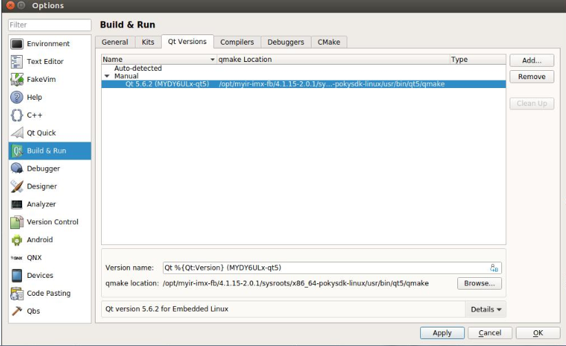
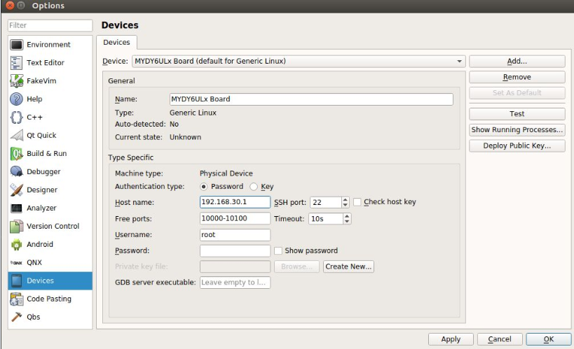

# 5.2 配置QtCreator

第一步，运行 QtCreator 后，依次点击"Tool"->"Options"，出现选项对话框，在左侧点击"Build & Run"，右边选择"Compilers"标签。
点击右侧"Add"按钮，弹出下拉列表后，选择"GCC"，在下面填写"Name"为"MYDY6ULx-GCC"，"Compiler path"点击旁边的"Browse.."按钮选 择到arm-poky-linux-gnueabi-g++的路径，例子中的路径是"/opt/myir-imx6ulx-fb/4.1.15-2.0.1/sysroots/x86_64-pokysdk-linux/usr/bin/arm-poky-linux-gnueabi/arm-poky-linux-gnueabi-g++"。填写完成后，点击"Apply"。

图5-2-1 配置编译器

第二步，选择"Qt Version"标签，在右侧点击"Add..."，会弹出qmake路径选择对话框，这里以"/opt/myir-imx6ulx-fb/4.1.15-2.0.1/sysroots/x86_64-pokysdk-linux/usr/bin/qt5/qmake"为例子。选择”qmake”文件后，点击"Open"按钮。"Version name"改为"Qt %{Qt:Version} (mys6ulx-qt5)"。然后点击"Apply"按钮。

图5-2-2 配置Qt版本

第三步，选择左侧"Device"，点击右边的"Add..."按钮，在弹出的对话框中选择Generic Linux Device,再填写内容"Name"为"MYDY6ULx Board"，"Host name"为开发板的IP地址(可以暂时填写任意一个地址)，"Username"为"root"，然后点击"Apply"。

图5-2-3 配置设备

第四步，点击左侧"Build & Run"回到"Kits"标签下，"Name"为"MYDY6ULx-dev-kit"，"Device"选择"MYDY6ULx Board"选项了。"Sysroot"选择目标设备的系统目录，这里以"/opt/myir-imx6ulx-fb/4.1.15-2.0.1/sysroots/cortexa7hf-neon-poky-linux-gnueabi"为例。"Compiler"选择之前配置的名称"MYDY6ULx-GCC"，"Qt version"选择之前配置的名称"Qt 5.6.2 (mys6ulx-qt5)"，"Qt mkspec"填写为"linux-oe-g++"。其它默认即可，最后点击"Apply"和"OK"按钮。

图5-2-4 配置套件
