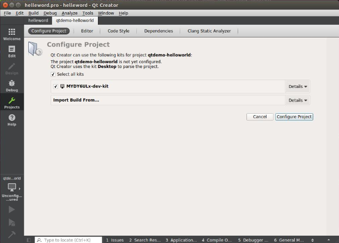
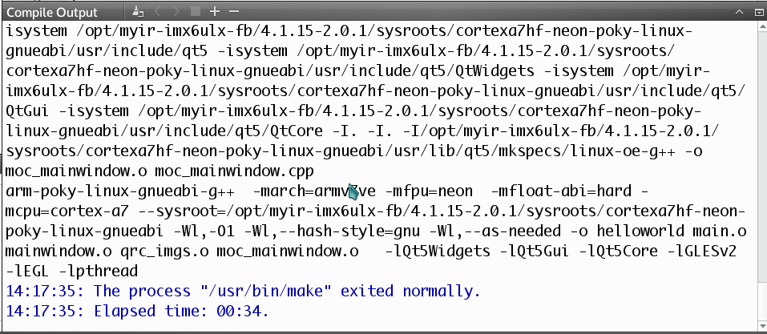

# 5.3 测试Qt应用

为了方便测试之前的配置是否正确，这里提供了一个Qt例程，打开项目后，配置为相应的编译工具套件，就可以编译此例程。

第一步，在菜单栏选择"File"->"Open File or Project"，在打开的对话框中，浏览到"helloword"例程的目录下，选择"helloworld.pro"文件，点击"Open"按钮。

第二步，项目打开后，在左侧菜单列中，选择"Projects"图标，右侧界面切换为"helloworld"项目的"Build & Run"标签下，点击"Add kit"下拉列表，选择"MYS6ULx-dev-kit"选项，这样"helloworld"项目就会使用"MYS6ULx-dev-kit"的相关配置构建应用。


图5-3-1 选择构建配置

第三步，点击菜单栏"Build"->"Build Project hellowrld"按钮，即可完成项目的编译，同时下侧会有编译过程输出。


图5-3-2 编译输出结果

QtCreator 构建 helloworld 项目后，编译好的二进制文件存放在"~/build-helloworld-MYS6ULx_dev_kit-Debug/"目录下，可以使用 file 命令查看，是否编译为 ARM 架构。

```
file ~/build-helloworld-MYS6ULx_dev_kit-Debug/helloworld
/home/kevinchen/build-helloworld-MYS6ULx_dev_kit-Debug/helloworld: 
ELF 32-bit LSB executable, ARM, EABI5 version 1 (GNU/Linux), 
dynamically linked, interpreter /lib/ld-linux-armhf.so.3, 
for GNU/Linux 2.6.32, 
BuildID[sha1]=9c5f22deb1d8272c2a81528c171d215896112784, not stripped
```

然后将 helloworld 文件拷贝到开发板下运行即可。

```
# ./helloworld -platform linuxfb
```
将会在 LCD 屏幕上看到Qt 窗口中多个QLabel的文本内容。


图5-3-3 例程运行结果
