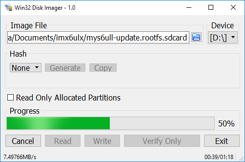

# 6.2 SD卡更新

MYD-Y6ULX开发板提供了一个使用SD卡更新系统镜像的文件，sdcard镜像文件。sdcard镜像文件需要使用特殊的磁盘操作工具才可以写入Micro SD卡内，Linux系统用户可以直接使用dd命令，Windows系统用户使用Win32ImageWriter工具。

MYD-Y6ULX的开发资源包内已包含两个sdcard文件，位置为02-Images。

文件名 | 描述
------ | -----
myd-y6ull-update-nand-base-20171026011019.rootfs.sdcard | 用于MYD-Y6ULL更新core-image-base
myd-y6ull-update-nand-qt5-20171026011028.rootfs.sdcard | 用于MYD-Y6ULL更新fsl-image-qt5
myd-y6ul-update-nand-base-20171026011019.rootfs.sdcard | 用于MYD-Y6UL更新core-image-base
myd-y6ul-update-nand-qt5-20171026011028.rootfs.sdcard | 用于MYD-Y6UL更新fsl-image-qt5


注意：rootfs.sdcard前面的时间为生成文件时的日期时间，请以实际文件为主。

## 制做SD更新的镜像

如果对Linux kernel，U-Boot或者文件系统有修改，可以自行打包制做sdcard文件，将系统烧写在开发板上。MYD-Y6ULX开发板提供了一个可以制做SD更新镜像的工具MYD-6ULX-mkupdate-sdcard，存放在04-Tools/ManufactoryTool目录。

build-sdcard.sh脚本用于制做从SD卡更新系统的镜像，分为两个部分：更新系统和目标文件。
firmware目录下是更新系统，一般情况下不需要修改。
'mfgimages-*'是目标文件，里面的文件最终会烧写进板载的NAND或者eMMC存储芯片内。如果修改u-boot, kernel后，需要把相应的文件替换到目标文件内即可。

'mfgimage-*'目录内的文件名遵循以下方式命名，错误的文件名称在更新系统时不会被识别，会出现升级失败。
这些文件的名称被定义在Manifest文件内，命名规则如下：

```
ubootfile="u-boot.imx"
kernelfile="zImage"
dtbfile="myd-y6ull-gpmi-weim.dtb"
rootfsfile="core-image-base.rootfs.tar.xz"
```
更新程序启动后会根据Manifest文件加载需要的文件，以将它们写入到目标NAND Flash存储芯片。

解压后就可以开始制做镜像了。

```
sudo ./build-sdcard.sh -p myd-y6ull -n -d mfgimages-myd-y6ull-ddr256m-nand256m
```

build-sdcard.sh提供了四种参数：
* '-p' 表示平台，可用参数为"myd-y6ull"代表MYD-Y6ULL
* '-n' 表示板上存储芯片是NAND
* '-e' 表示板上存储芯片是eMMC
* '-d' 表示更新文件的目录
* '-t' 表示添加文件名标识

注意：'-n'和'-e'不能同时使用，只能使用一种。

运行结束后会生成一个sdcard后缀的文件，如'myd-y6ull-update-nand-20170825150819.rootfs.sdcard'。

## 制做可更新系统的SD卡

MYD-Y6ULX资源包内提供了用于更新系统的sdcard镜像文件，可以直接使用，也可以使用上一步制做的sdcard文件。MYD-Y6ULX提供好的sdcard文件存放在02-Images目录内。
有了用于更新的SD卡镜像文件，就可以把镜像文件写入到SD卡。为了方便使用，建议把Micro SD插入USB读卡器，再插入电脑USB端口。

注意: 02-Images目录内的文件名的时间标识部分可能与如下示例文件有差异，请以实际为主。

* Linux系统

通常Linux下的存储设备名为"sd[x][n]"形式，x表示第几个存储设备，一般使用字母a~z表示。n表示存储设备的分区，一般使用数字，从1开始。插入后可以使用"dmesg | tail"命令查看新设备的设备名称。这里以"/dev/sdb"设备为例，sdb后面不写任务分区数字。

```
sudo dd if=myd-y6ull-update-nand-base-20170919090957.rootfs.sdcard of=/dev/sdb conv=fsync
```

写入的速度与USB和Micro SD卡的速率有关，如果对速度有要求，建议选用更高速度等级的Micro SD存储卡。

* Windows系统

Windows用户可以使用Win32DiskImager工具把sdcard镜像写入Micro SD里。工具在"03-Tools"目录下，解压后，双击"Win32DskImager.exe"应用程序。启动后的界面中，右侧的"Device"是选择要写入的设备盘符。左侧的"Image File"是选择将要写的镜像文件，点击旁边的文件夹图标，选中要写入的文件即可(注意：文件选择对话框中默认是过滤"*.img"文件，切换成"*.*"，就可以显示到sdcard后缀的文件)。

写入前请再次确认目标磁盘和文件是否正确，避免写入到系统磁盘，损坏Windows系统分区。



等待进度条结束后，就可以拔出USB读卡器。

把制做好的Micro SD卡插入开发板的卡槽(J8)，配置启动位拨码开关(SW1)为SDCARD启动方式，如下：

启动位 | 状态 
--- | ----
Bit1 | ON
Bit2 | OFF
Bit3 | ON
Bit4 | OFF

连接USB转TTL串口线至调试串口(JP1)，配置好电脑端的串口终端软件。使用DC 12V电源适配器连接至开发板的电源接口(J22)。通过串口可以看到系统从Micro SD卡启动，并执行更新脚本，把Linux系统镜像文件写入NAND存储芯片内。

也可以通过用户LED灯(D30)来判断当前更新状态，更新中为闪烁状态，更新成功后会常亮，失败则会熄灭。

## 切换为NAND启动方式

更新完成后断电，配置启动位拨码开关为NAND启动方式，如下：

启动位 | 状态 
--- | ----
Bit1 | OFF
Bit2 | ON
Bit3 | ON
Bit4 | OFF

重新连接电源，开发板就可以从NAND启动系统了。

